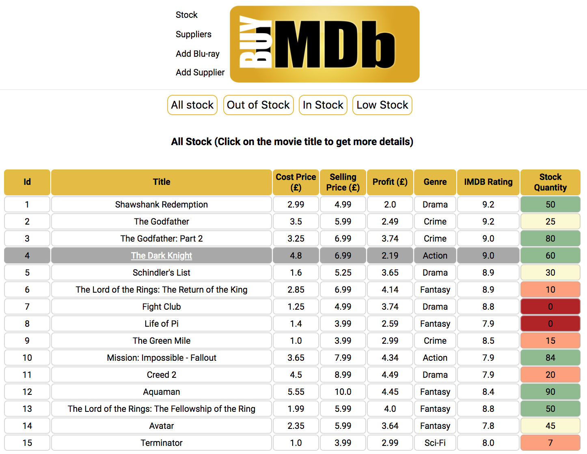
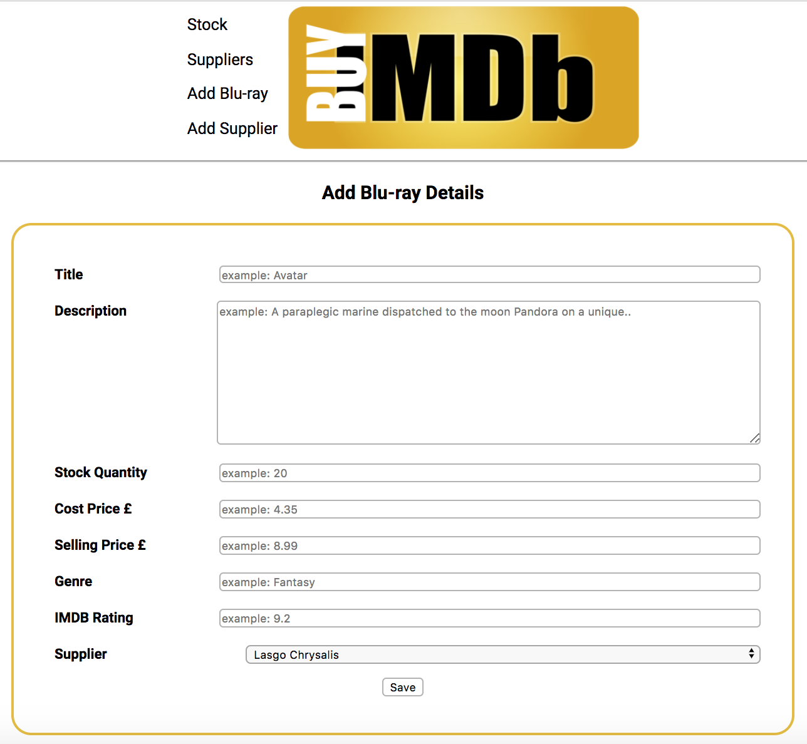

# Solo Project: Blu-Ray Store

A Full-Stack RESTful App for a Blu-Ray Store For An Owner, written in Ruby, wanting to keep track of stock.

## Brief
The owner of a Blu-Ray Store wants an app to track their shop's inventory. This is not an app which the customer will see, it is an admin/management app for the shop workers.

## Table of contents
* [MVP](#mvp)
* [Extensions](#extensions)
* [My Extras](#my-extras)
* [Status](#status)
* [Screenshots](#screenshots)
* [Technologies](#technologies)
* [Setup](#setup)
* [Run](#run)
* [What I Have Learned And Enjoyed](#what-i-have-learned-and-enjoyed)
* [Parting Words](#parting-words)

## MVP
* Created blu-rays including a name, description, stock, quantity, buying cost and selling price
* Created a suppliers list linked to the blu-rays, including name and other appropriate details
* Showed an inventory page listing blu-rays
* Includde CRUD functionality
* Showed an inventory page, listing all the details for all the blu-rays in stock in a single view
* Showed a visual highlight  of `low stock` and `out of stock`

## Extensions
* Added an `In Stock` and `All Stock` filter buttons
* Added CSS styling link to High Stock, Low Stock (etc) function, for auto-colouring
* Added the markup (profit) on each Blu-ray

## My Extras
* Added pre-population of Suppler and Blu-Ray edit function

## Status
Project is: _in progress_

To-do list:
* Add a search facility
* Add a sort by genre facility (back end complete for this)
* Add filters on each table heding to order ASC and DES.

## Screenshots

Main Inventory Page <br>

<br>
<br>
Add A Bu-Ray 
<br>



## Technologies
* Language - Ruby
* Styling - HTML and CSS
* Database - PSQL

## Setup
```
$ createdb buymdb
$ psql -d buymdb -f db/buymdb.sql (in master file)
$ ruby db/seeds.rb
$ ruby app.rb

```
## Run
[Local Host :4567](http://localhost:4567/)


## What I Have Learned and Enjoyed
From this CodeClan Solo Project
* Implementing my first full-stack, RESTful, web app
* Combing Ruby with CSS to apply an if statement to styling outcomes (VERY FUN!)


## Parting Words
I am open to improvements, so please let me know what you think - feel free to contact me!
